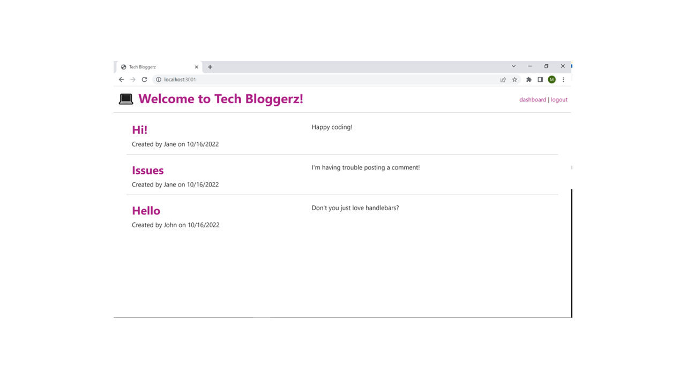

# Tech_Bloggerz

Tech_Bloggers is a CMS-style blog site where developers can publish their blog posts and comment on other developers’ posts. The app follows the MVC paradigm in its architectural structure, using Handlebars.js as the templating language, Sequelize as the ORM, and the express-session npm package for authentication.

## Screenshot of Home Page
---

## Deployed URL
---
Application Heroku URL : <a href= "">Visit Monica's Heroku Application</a> 

Application GitHub URL : <a href= "https://github.com/monicadolce/Tech_Bloggerz">Visit Monica's GitHub Repository</a> 

